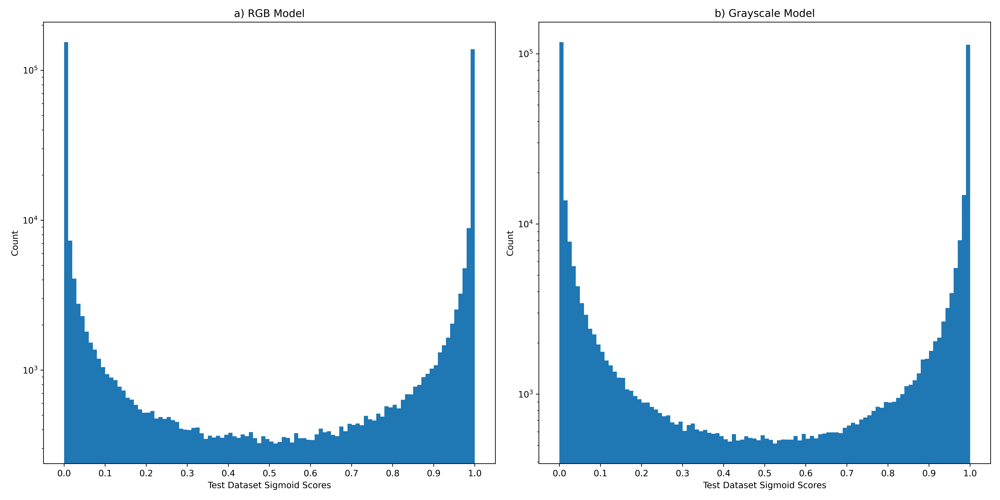
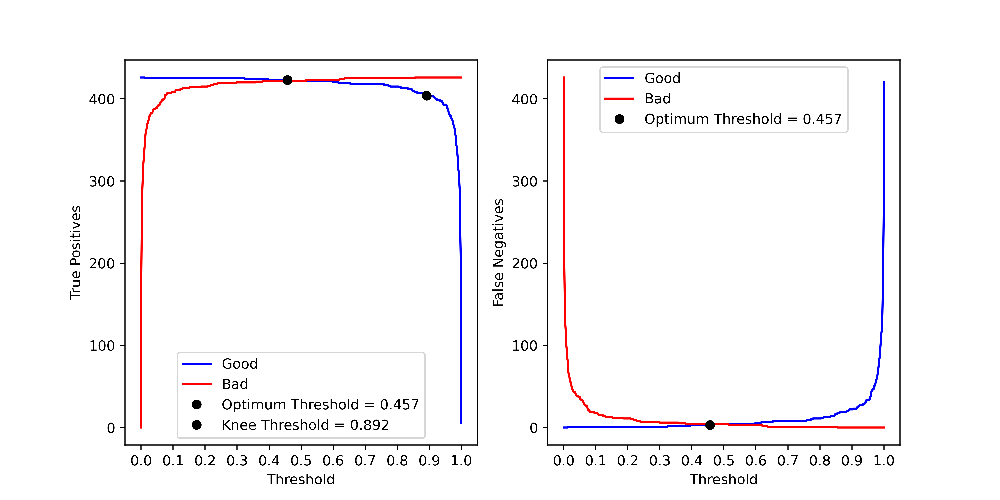

# ShorelineFilter

# Requirements
Python>=3.10, geopandas, pandas, os, glob, numpy, rasterio, shapely, scikit-image, scipy, tensorflow, kneed, matplotlib, shutil, sys, osgeo/gdal

```
conda update -n base conda
conda clean --all
python3 -m pip install --upgrade pip
```

Make environment, download requirements. For GPU, set up a gym environment from instructions here: 

[gym_install](https://github.com/Doodleverse/Segmentation_Gym?tab=readme-ov-file#%EF%B8%8F-installation)

```
conda create -n shoreline_filter python=3.10 -y
conda activate shoreline_filter
conda install tensorflow geopandas pandas rasterio shapely scikit-image scipy matplotlib pygraphviz -y
pip install kneed
pip install pydot
```

A CoastSeg environment will likely have most of these requirements.

# Image Suitability Filter

* Modules contained in image_filter.py

* Training and testing the model

```
def train_and_test(dataset):
    """
    trains, tests, outputs metric figures
    inputs:
    dataset (str): path to the dataset
                   dataset
                          train
                               good
                               bad
                          test
                               good
                               bad
    """
```

* Running model in inference mode

```
def run_inference_rgb(path_to_model_ckpt,
                      path_to_inference_imgs,
                      output_folder,
                      result_path,
                      threshold=0.335,
                      sort=True):
    """
    Runs the trained model on images, classifying them either as good or bad
    Saves the results to a csv (image_path, class (good or bad), score (0 to 1)
    Sorts the images into good or bad folders
    Images should be '.jpg'
    inputs:
    path_to_model_ckpt (str): path to the saved keras model
    path_to_inference_imgs (str): path to the folder containing images to run the model on
    output_folder (str): path to save outputs to
    result_path (str): csv path to save results to
    threshold (float): threshold on sigmoid of model output (ex: 0.6 means mark images as good if model output is >= 0.6, or 60% 		       sure it's a good image)
    sort (bool): True to sort images, False to not sort (this is mainly for testing)
    returns:
    result_path (str): csv path of saved results
    """
```

This is a binary classification model that sorts out unsuitable imagery for shoreline extraction (among other applications). It was trained on over a million coastal satellite images from around the world. It uses an Xception-esque architecture.


Above shows ROI locations where images were pulled from to train this model.


Above shows some curves that tell us what threshold to run the models (RGB or grayscale) at to balance true and false positives. 


Above shows some example outputs from the test dataset where the model was extremely confident they were 'good' or 'bad'.


Above shows some example outputs from the test dataset where the model was not so confident (edge cases).



Above shows the distribution of sigmoid scores (probability of image being 'good') from the test dataset. It's bimodal and symmetric indicating the model learned how to distinguish the two classes very well.


Above shows the ROC curve. The RGB model is slightly more effective than the grayscale model.

# Image Segmentation Filter

* Modules contained in image_segmentation_filter.py

* Training and testing the model

```
def train_and_test(dataset):
    """
    trains, tests, outputs metric figures
    inputs:
    dataset (str): path to the dataset
                   dataset
                          train
                               good
                               bad
                          test
                               good
                               bad
    """
```

* Running model in inference mode

```
def run_inference_rgb(path_to_model_ckpt,
                      path_to_inference_imgs,
                      output_folder,
                      result_path,
                      threshold=0.457,
                      sort=True):
    """
    Runs the trained model on images, classifying them either as good or bad
    Saves the results to a csv (image_path, class (good or bad), score (0 to 1)
    Sorts the images into good or bad folders
    Images should be '.jpg'
    inputs:
    path_to_model_ckpt (str): path to the saved keras model
    path_to_inference_imgs (str): path to the folder containing images to run the model on
    output_folder (str): path to save outputs to
    result_path (str): csv path to save results to
    threshold (float): threshold on sigmoid of model output (ex: 0.6 means mark images as good if model output is >= 0.6, or 60% 		       sure it's a good image)
    sort (bool): True to sort images, False to not sort (this is mainly for testing)

    returns:
    result_path (str): csv path of saved results
```


This is a binary classification model that sorts out bad segmentation outputs. It was trained on just over 2,000 images from around the world. It's a pretty basic 2D convolutional neural network. 


Above are some examples of 'good' and 'bad' outputs.



Above are curves that indicate the optimum threshold to run the model at in practice.


Above is the distribution of sigmoid scores (probability of a good segmentation) from the test dataset.


Above is the ROC curve for this model.

# Shoreline Change Envelope (KDE filter)

* Modules contained in shoreline_change_envelope.py

* Running on a single session

```
def get_point_density_kde(extracted_shorelines_points_path, 
                          point_density_kde_path,
                          otsu_path,
                          shoreline_change_envelope_path,
                          shoreline_change_envelope_buffer_path,
                          cell_size=20,
                          buffer=50):
    """
    Makes a point density heat map, otsu threshold, polygonized result, buffered polygonized result
    inputs:
    extracted_shorelines_points_path (str): path to the extracted shorelines as points
    point_density_kde_path (str): path to save the point density result to (.tif)
    otsu_path (str): path to save otsu to (.tif)
    shoreline_change_envelope_path (str): path to save shoreline change envelope to (.geojson)
    shoreline_change_envelope_buffer_path (str): path to save the buffered shoreline change envelope to (.geojson)
    cell_size (int): resolution of the output heatmap in meters, default is 20 m, can go finer if needed but will slow this down
    buffer (float): amount to buffer the envelope, default = 50 m
    outputs:
    point_density_kde_path (str): path to the result
    """
```

This is just a method for computing a heat map of the extracted shoreline points, and then converting that heat map into a polygon feature that can be used as a spatial filter for extracted shorelines. Basically, we remove erroneous shoreline points by only keeping where most of the shorelines extracted from a long timeseries of satellite imagery fall. Shoreline points way outside of the average location get thrown out.


Above shows the progression of this filter. We take our unfiltered extracted shoreline points for a particular ROI. Then we compute a spatial kernel density estimate of the points. We then convert this to a raster and then use Otsu thresholding to classify the raster into two categories (high density and low density). We then isolate the high density pixels and polygonise these pixels to get an envelope of shoreline change that we can use to filter erroneous points.


Above shows an example of using these filters on an ROI from western Alaska. A final filter involves taking the timeseries data and removing outliers and high-frequency noise with a median filter. We then re-project the cross-shore positions to geographic coordinates to get cleaner looking shorelines.


